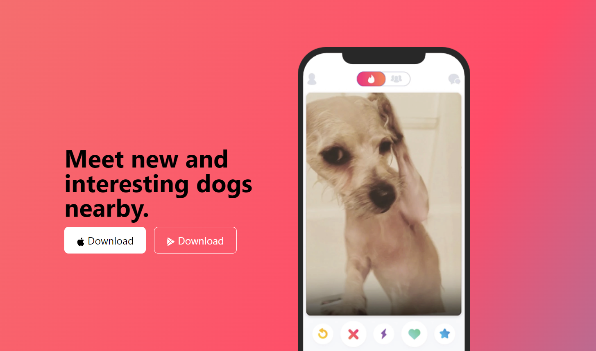

<!DOCTYPE html>
<html lang="en">

<head>
  <meta charset="UTF-8">
  <meta name="viewport" content="width=device-width, initial-scale=1.0">
</head>
<body>
<h1 style="text-align:center">Welcome!</h1>

This repository is dedicated to frontend projects. I am committed to enhancing my HTML, CSS, and CSS frameworks skills, and I will consistently develop frontend projects to showcase my capabilities.

<ul>
<li>TinDog</li>

This landing page is part of the Udemy course: <a href="https://www.udemy.com/course/100-days-of-code/">100 days of code: Python bootcamp</a>, Day 57: Bootstrap.

Thank you to <a href="https://codepen.io/P1N2O/pen/pyBNzX">Manuel Pinto </a>for creating this beautiful gradient background animation for the title and footer sections.

And thank you to Angela Yu, the instructor of the 100 days of code: Python bootcamp, for creating such a fun project!

</ul>
</body>
</html>