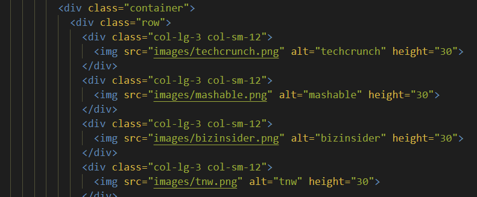

<!DOCTYPE html>
<html lang="en">

<head>
  <meta charset="UTF-8">
  <meta name="viewport" content="width=device-width, initial-scale=1.0">
</head>
<body>
<h1 style="text-align:center">Welcome to TinDog's landing page!</h1>
<h2 style="text-align:center">&#x1F495;Tinder for dogs&#x1F495;</h2>

Help your dog to meet new and interesting dogs nearby! 
You have a dog? You want your dog to have friends? Let's use TinDog!

This landing page is part of the Udemy course: <a href="https://www.udemy.com/course/100-days-of-code/">100 days of code: Python bootcamp</a>.

<h3>How did I build this landing page?</h3>

From the Examples section on <a href="https://getbootstrap.com/docs/10.3/examples/">getboostrap.com</a>, in the snippets and custom components category:

<ul>
<li>Title section: Heroes > "Responsive left-aligned hero with image"</li>

<li>Features section: Features > "Hanging icons"</li>

<li>Testimonial section: Jumbotron > "Full-width jumbotron"</li>

For the images below, I added a container div and a row div, then added the 4 images.

<li>Pricing section: Pricing > "Copy only the divs for the title "Pricing" and the price cards"</li>

<li>Footer section: Footers > 4th from the top</li>

</ul>
<h3>Thank you!</h3>

Thank you to <a href="https://codepen.io/P1N2O/pen/pyBNzX">Manuel Pinto </a>for creating this beautiful gradient background animation for the title and footer sections.

And thank you to Angela Yu, the instructor of the 100 days of code: Python bootcamp, for creating such a fun project!

</body>